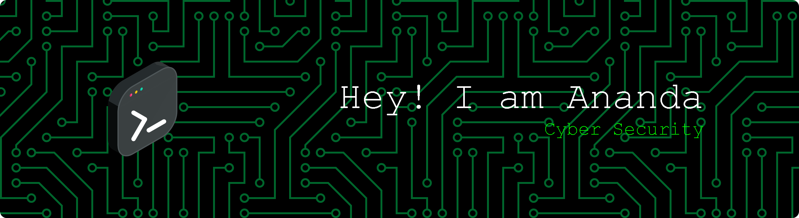

<h1 align="center">Hello 👋, I'm Ananda</h1>

<h3 align="center">🔐 Cybersecurity Enthusiast | Informatics Student | Bug Hunter</h3>

# 💫 About Me

🎓 **Informatics Student** (2024) at Universitas Singaperbangsa Karawang, Indonesia  
🔒 **Cybersecurity Specialist** - Passionate about ethical hacking, penetration testing, and information security  
🎯 **Focus Areas**: Network Security, Vulnerability Assessment, Malware Analysis, Incident Response  
👯 I'm looking to collaborate on cybersecurity projects, CTF (Capture The Flag) challenges, and open-source security tools  
🤝 I'm looking for help with advanced exploitation techniques and security research  
🌱 I'm currently learning: Red Team techniques, cryptography, exploit development, and cloud security  
💬 Ask me about cybersecurity, ethical hacking, or secure coding practices  

## 🌐 Socials
 
 

  

# 🔧 Security Skills & Tools

**Security Tools & Frameworks:**
- 🛡️ Penetration Testing: Metasploit, Burp Suite, Wireshark, Nmap
- 🔍 Vulnerability Scanning: OWASP ZAP, Qualys, Nikto
- 🔐 Cryptography & Hashing: OpenSSL, Hashcat
- 📊 Network Analysis: Wireshark, tcpdump, Aircrack-ng
- 🔨 Custom Security Tools Development

# 💻 Tech Stack

# 👨🏻‍💻 Workspace Setup

# 📊 GitHub Stats

# 📈 GitHub Activity

### ✍️ Random Dev Quote

### 🔐 Security Quote
> "In the world of cybersecurity, staying updated is not optional—it's essential. The threat landscape evolves every day."

